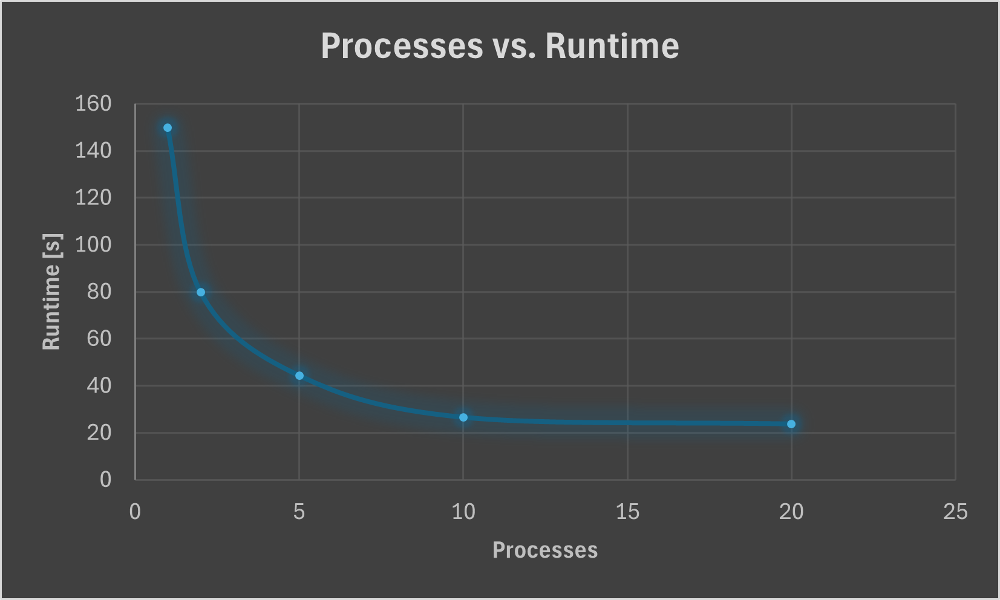

# System Programming Lab 11 Multiprocessing

## Overview
For this Lab, I decided to just modify the provided mandelbrot program, adding two command line arguments
- -n which controls the number of frames to generate
- -p which controls the number of processes to use during generation

I used a simple for loop to create the number of processes up to the value defined by the -n argument then ran the image generation code in each loop.

``` C
  for(int i = 0; i < num; i++){
    if(active_proc >= max_proc){
      wait(NULL);
      active_proc--;
    }

    int pid = fork();
    if (pid == 0){


		//modifies the x scale for each child process
    double child_xscale = xscale / pow(1.1, i);
...
```
## Processes vs. Runtime



The runtime follows an inverse exponential, where the first increases have very large time losses associated with them, but the difference decreases as the number of processes increases

## Multithreading
In lab 12, I added the -t argument which controls the number of threads used to generate the images.

I used a struct to pass in the relevent coordinates with the start and stop values so that each section could be generated independantly

``` C
typedef struct {
    imgRawImage *img;
    double xmin;
    double xmax;
    double ymin;
    double ymax;
    int max;
    int start_row;
    int end_row;
} thread_args;
```

With these modifications, I was able to make a table of number of processes compared to number of threads.

|Proc\Threads|1|2|5|10|20|
|------------|-|-|-|--|--|
|1|4m23.135s|2m38.939s|1m25.639s|0m51.864s|0m41.879s|
|2|2m9.177s|1m25.394s|0m46.723s|0m35.155s|0m32.924s|
|5|0m59.999s|0m41.582s|0m32.935s|0m32.902s|0m33.120s|
|10|0m33.190s|0m30.193s|0m30.324s|0m34.353s|0m30.920s|
|20|0m29.933s|0m28.757s|0m31.058s|0m29.499s|0m29.908s|

After testing, It seemes like changing the number of processors has the greatest effect on runtime. This is likely because the processors allow more threads to be created and ran in parallel. There seems to be a "sweet spot" at 20 processes and 2 threads.